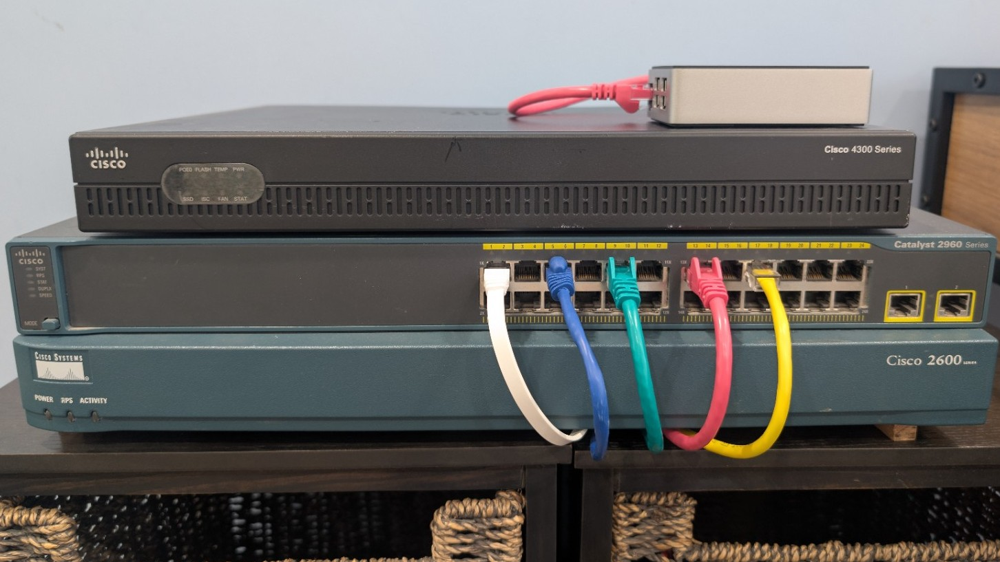
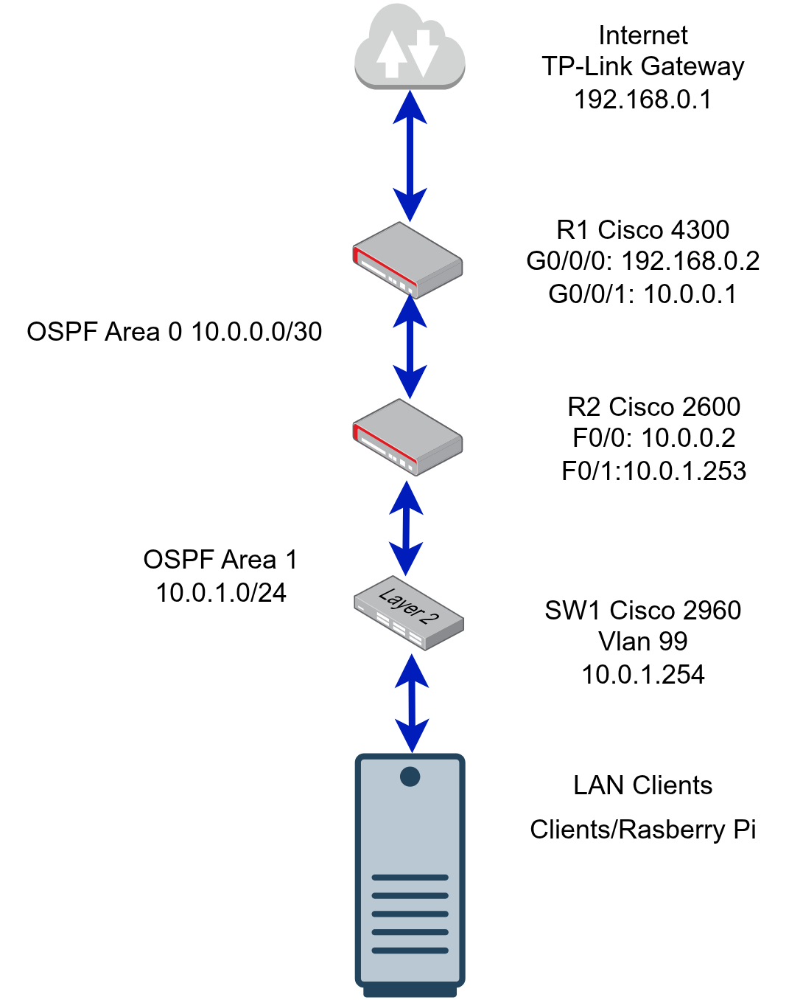

<nav class="page-nav">
  <a href="index">Home</a>
  <a href="about">About</a>
  <a href="skills">Skills</a>
  <a class="active" href="projects">Projects</a>
  <a href="packet-tracer">Packet Tracer</a>
  <a href="career-goals">Career Goals</a>
  <a href="resume">Professional Profile</a>
</nav>

# Projects

## Cisco Homelab Network

  

A physical Cisco environment for configuring, verifying, documenting, and troubleshooting routed and switched networks. It complements my degree and CCNA preparation by putting Cisco IOS work onto real hardware.

### Lab Hardware

The current environment includes:

- Cisco 4300 Series Router (R1)
- Cisco 2600 Series Router (R2)
- Cisco Catalyst 2960 Switch (SW1)
- Raspberry Pi running Linux
- Laptop and PC client devices
- TP-Link bridge providing connectivity to the home network

### Network Topology

The documented topology connects R1 to the home gateway, uses a `/30` transit link between R1 and R2 in OSPF Area 0, and places the LAN behind R2 in Area 1.

### IP Addressing Plan

#### Edge Network — 192.168.0.0/24

| Device | Interface | IP Address | Purpose |
|---|---|---:|---|
| TP-Link gateway | — | 192.168.0.1/24 | Upstream gateway |
| R1 (Cisco 4300) | G0/0/0 | 192.168.0.2/24 | Edge interface |

R1 uses a static default route via `192.168.0.1`.

#### OSPF Area 0 — 10.0.0.0/30 Transit

| Device | Interface | IP Address | Role |
|---|---|---:|---|
| R1 (Cisco 4300) | G0/0/1 | 10.0.0.1/30 | Area 0 backbone |
| R2 (Cisco 2600) | F0/0 | 10.0.0.2/30 | Area 0 backbone |

This point-to-point subnet carries the OSPF adjacency and routed traffic between the two routers.

#### OSPF Area 1 — 10.0.1.0/24 LAN

| Device | Interface | IP Address | Notes |
|---|---|---:|---|
| R2 (Cisco 2600) | F0/1 | 10.0.1.253/24 | LAN default gateway |
| SW1 (Cisco 2960) | VLAN 99 | 10.0.1.254/24 | Switch management SVI |

R2 advertises the LAN into OSPF while keeping the LAN interface passive, so no OSPF neighbor relationship is attempted on the client segment.

#### Router IDs

| Device | Interface | IP Address | Purpose |
|---|---|---:|---|
| R1 | Loopback0 | 1.1.1.1/32 | OSPF Router ID |
| R2 | Loopback0 | 2.2.2.2/32 | OSPF Router ID |

### OSPF Design Summary

| Area | Network | Devices |
|---|---|---|
| Area 0 | 10.0.0.0/30 | R1 ↔ R2 (transit) |
| Area 1 | 10.0.1.0/24 | LAN behind R2 |

- R2 is the Area Border Router because it connects Areas 0 and 1.
- R1 provides the path toward the upstream gateway; R2 learns the default route through OSPF.
- The design provides a practical platform for routing-table checks, adjacency verification, reachability testing, controlled fault isolation, and infrastructure documentation.

## CareShield AI — ICT Capstone Project

CareShield AI was a team proof of concept for converting voice or text input into structured case notes for aged-care and NDIS work. My contribution focused on requirements analysis, planning, documentation, team coordination, and communicating the proposed system clearly.

The project provided experience in a structured ICT delivery environment and required attention to project risk, privacy, and the responsible handling of sensitive information. It is included here as evidence of teamwork and professional project practice; my primary technical direction remains network engineering.

